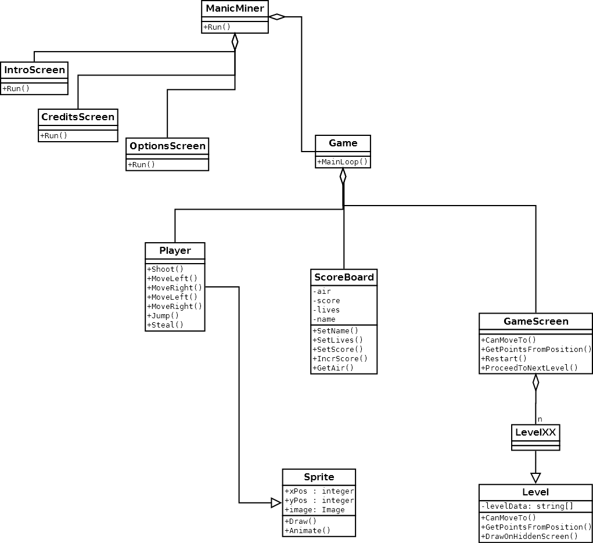

# manicMiner-taoSdl

This is the simplified classes diagram, which might give you a clue on how
the program is structured:

Also, in this folder you can find the a little documentation for the game,
such as the [original levels](./originalLevels) and the [original sprites](./originalSprites).

