# manicMiner-taoSdl

In this folder you can find the appearance of the 20 original levels of
Manic Miner (Amstrad CPC version), both with the original colors and
with a grid over it to discover the tiles of each level:

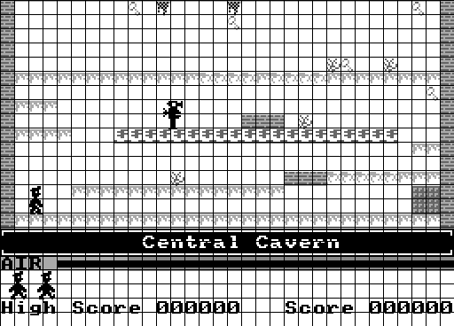

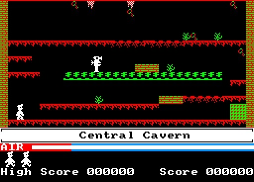

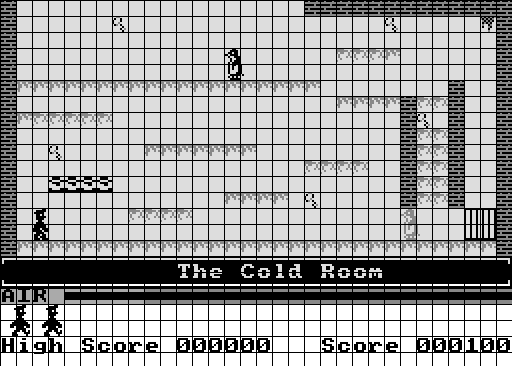

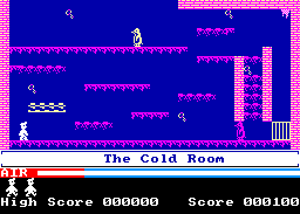

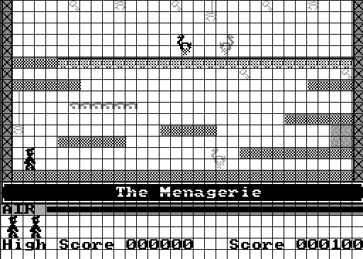

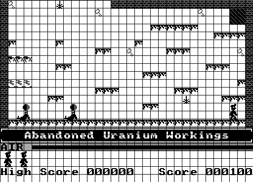

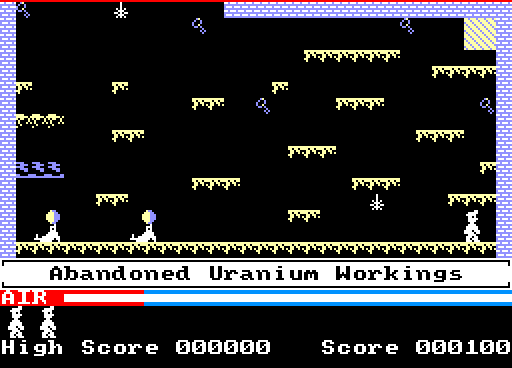

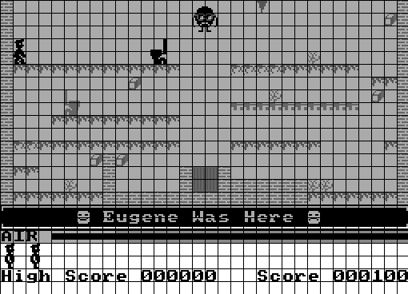

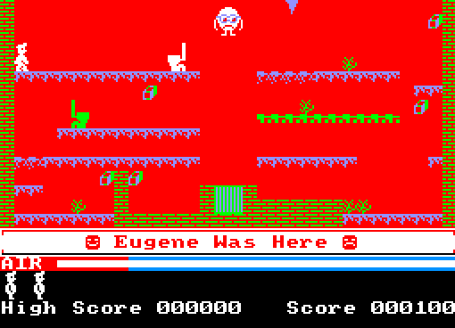

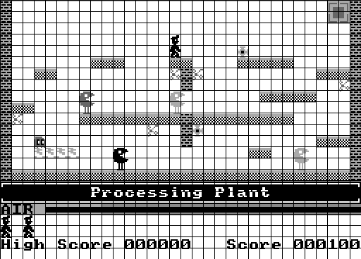

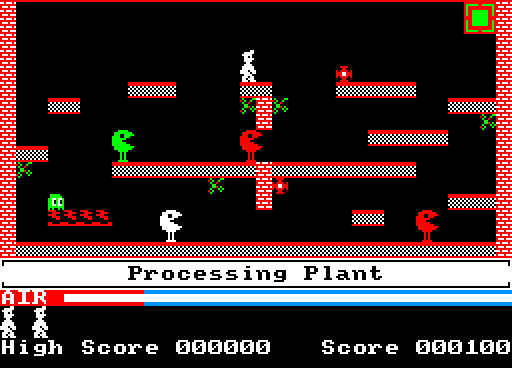

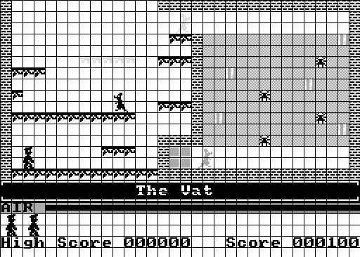

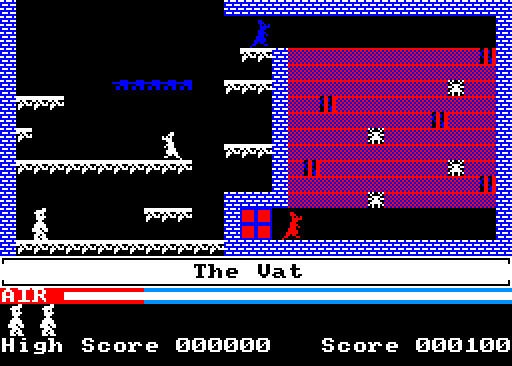

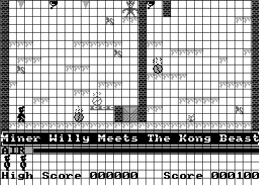

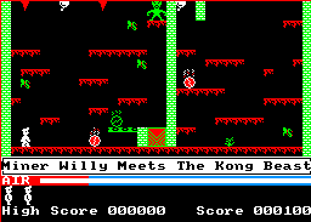

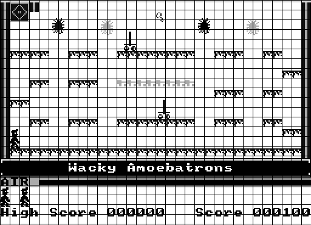

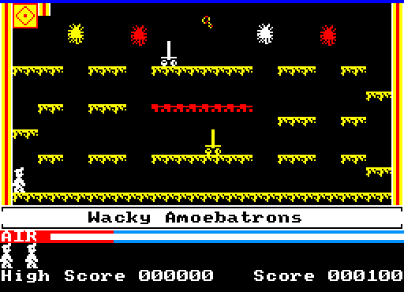

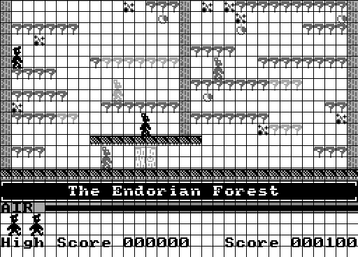

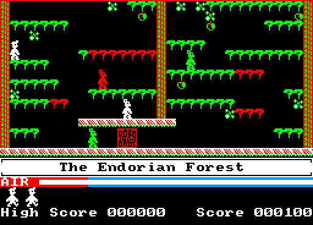

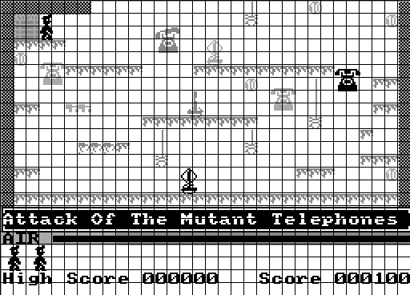

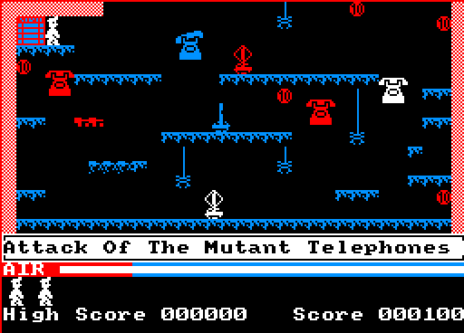

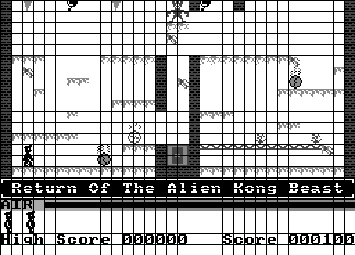

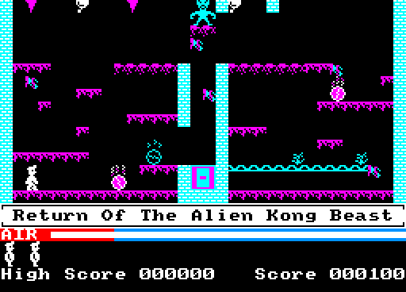

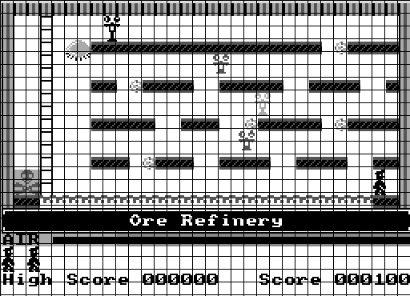

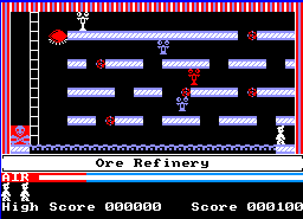

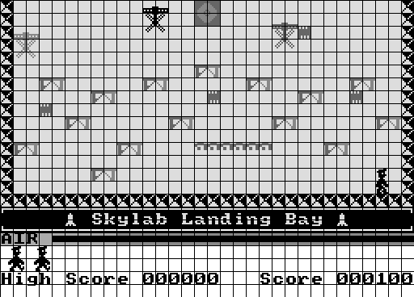

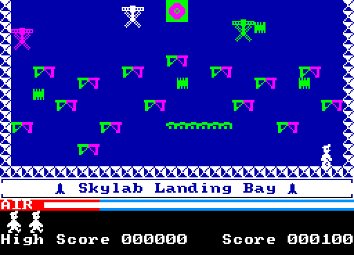

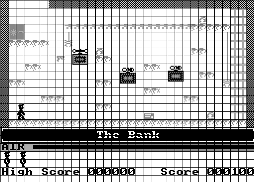

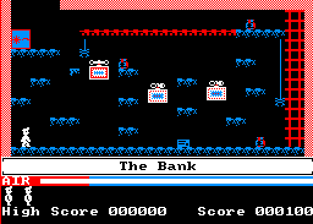

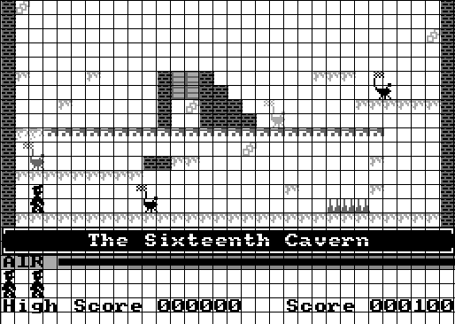

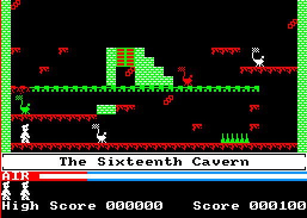

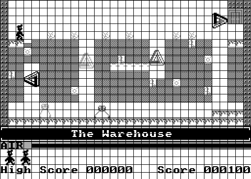

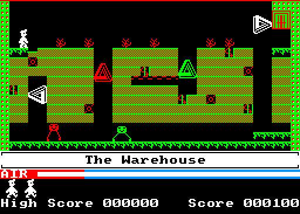

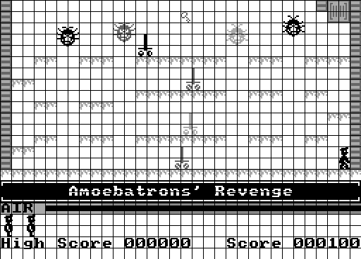

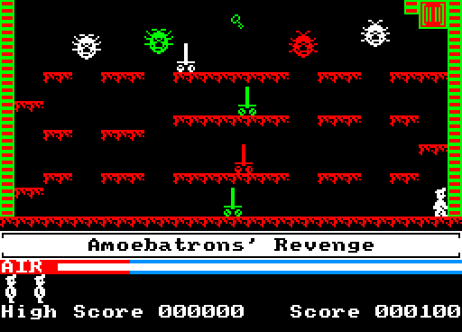

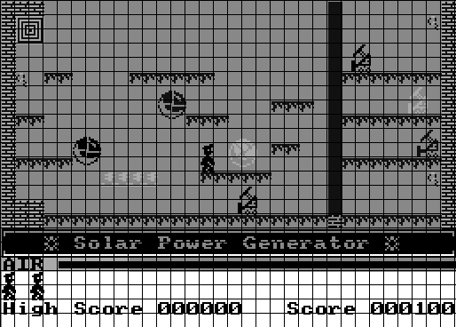

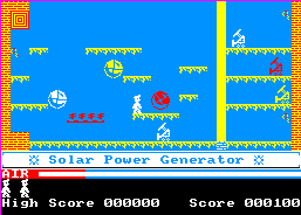

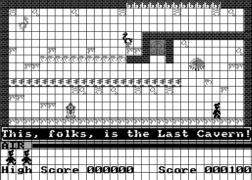

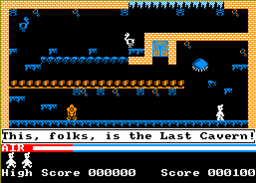

