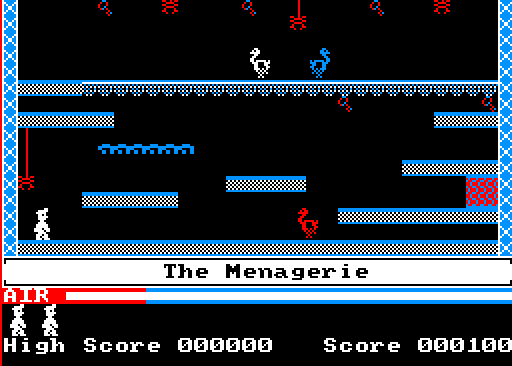

# manicMiner-taoSdl

In this folder you can find the appearance of the 20 original levels of
Manic Miner (Amstrad CPC version), both with the original colors and
with a grid over it to discover the tiles of each level:

Level 1:

Level 2:

Level 3:

Level 4:

Level 5:

Level 6:

Level 7:

Level 8:

Level 9:

Level 10:

Level 11:

Level 12:

Level 13:

Level 14:

Level 15:

Level 16:

Level 17:

Level 18:

Level 19:

Level 20:

